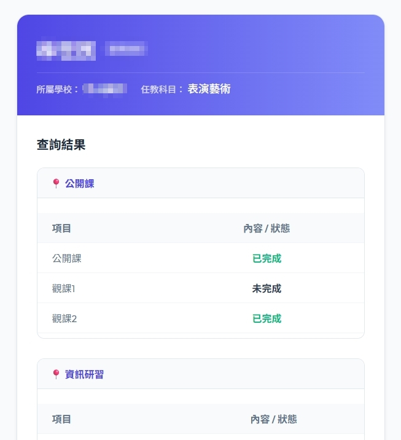
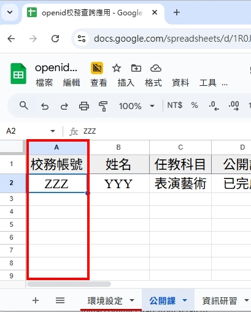
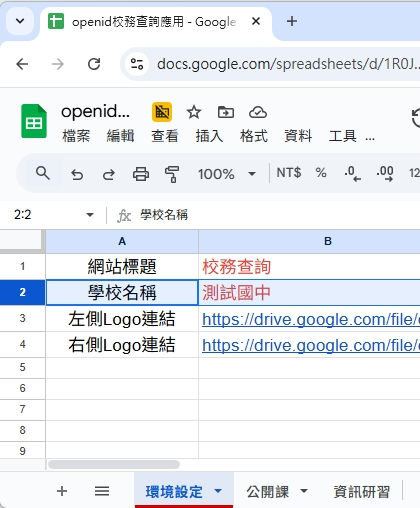

# 新北市教育局 OpenID 校務/班務資料查詢系統 (NTPC OpenID Sheet Query)

這是一個為新北市中小學設計的輕量級 Web App，讓教職員或學生能透過 **新北市教育局 OpenID** 安全地查詢分散在多個 Google 試算表分頁中的個人資料（如公開課、研習、成績...等）。

## 核心特色

- **身分驗證**：對接新北市教育局 OpenID 驗證系統，確保資料只能由本人讀取。
- **多表彙整**：自動掃描並彙整試算表中各個處室（分頁）的資料（預設排除「環境設定」等系統分頁）。
- **動態配置**：無需修改程式碼，即可透過「環境設定」分頁更改學校名稱、網站標題及校徽 Logo。
- **欄位偵測**：自動辨識「校務帳號」或「帳號」欄位，無需固定在首欄。

## 📸 介面預覽

| 🔑 登入首頁 | 📊 查詢結果 |
| :---: | :---: |
|  |  |
| **📝 資料準備 (欄位彈性)** | **⚙️ 環境設定** |
|  |  |

## 安全性控管

請架設者務必遵守以下規範：

1. **試算表權限**：原始試算表 **必須保持為「私人」**。Web App 以開發者身分執行，能存取表格資料但不會將權限洩漏給使用者。
2. **存取限制**：系統內建 `SCHOOL_RESTRICTION` 功能，會比對 OpenID 傳回的單位名稱，確保只有本校教職員能進入系統。
3. **隱私保護**：系統僅會在瀏覽器端顯示與該帳號完全匹配的資料列。
4. **自動過濾**：系統會自動掃描所有分頁，但會跳過「環境設定」等配置專用頁面。

> [!IMPORTANT]
> 詳細的資安建議與檢查清單，請參閱：[SECURITY_GUIDE.md](./SECURITY_GUIDE.md)

## 🚀 快速上手

1. **取得範本**：進入[📂範本資料夾](https://drive.google.com/drive/folders/1_sX98EgeDs2ujuz4vVSPHEq4oPFRTfyb?usp=sharing)，點選試算表後按右鍵點選「建立副本」。
2. **環境設定**：在「環境設定」分頁中，填入您的學校名稱及 Logo 連結。
3. **準備資料**：在您副本中的各個分頁填入資料。**重要：每一個分頁中一定要有一個名為「校務帳號」或「帳號」的欄位**，這樣程式才能正確比對並抓取資料。
4. **即刻部署**：
   - 點選試算表選單：`擴充功能` -> `Apps Script` (程式碼已預建在內，無需修改)。
   - 點選右上角 **`部署`** -> **`新部署`** -> 類型選擇 **`網頁應用程式`**。
   - 執行身分：**我 (Me)**。
   - 誰可以存取：**任何人 (Anyone)**。

## 部署時的心理準備

第一次部署時，Google 會跳出多個的警告視窗，這是正常的保護機制（因為您是這份程式碼的擁有者，而 Google 尚未針對您個人進行驗證）。

1. **授予存取權**
2. **選擇要授權的 Google 帳戶**
3. **這個應用程式未經驗證**：請點選左下角的 **「進階 (Advanced)」**，然後點選最下方的 **「前往 校務查詢 (不安全)」**。
   - *這不代表有病毒，只是 Google 提醒您這是由個人（您自己）維護的腳本。*
4. **要求存取權限**：系統會要求讀取您的試算表與雲端硬碟（讀取 Logo）。請放心點選 **「全選」**。
   - *本專案已在 `appsscript.json` 限制了最小權限（唯讀 Drive 檔案）。*
5. **開始使用**：將產生的網址分享給校內師生即可！

## 📄 授權協議

本專案採用 [GNU General Public License v3.0](LICENSE) 授權
